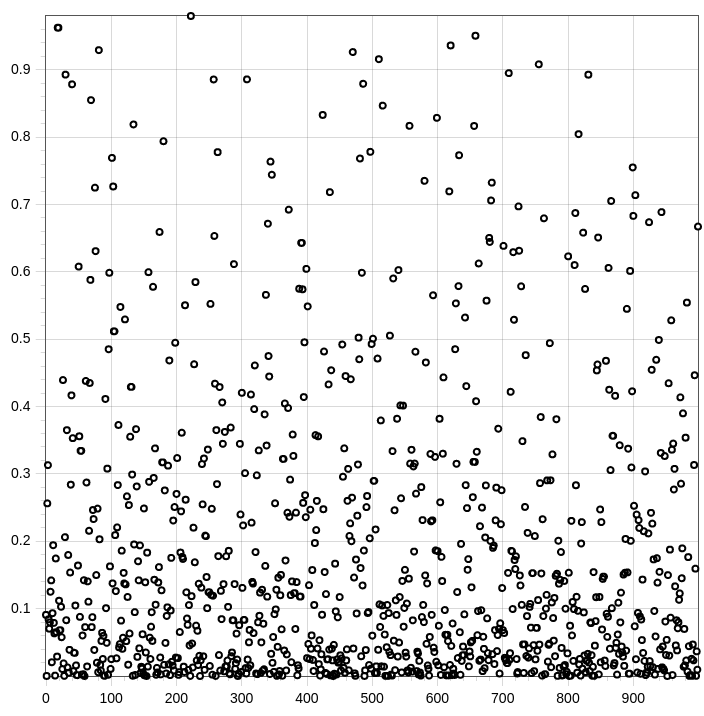
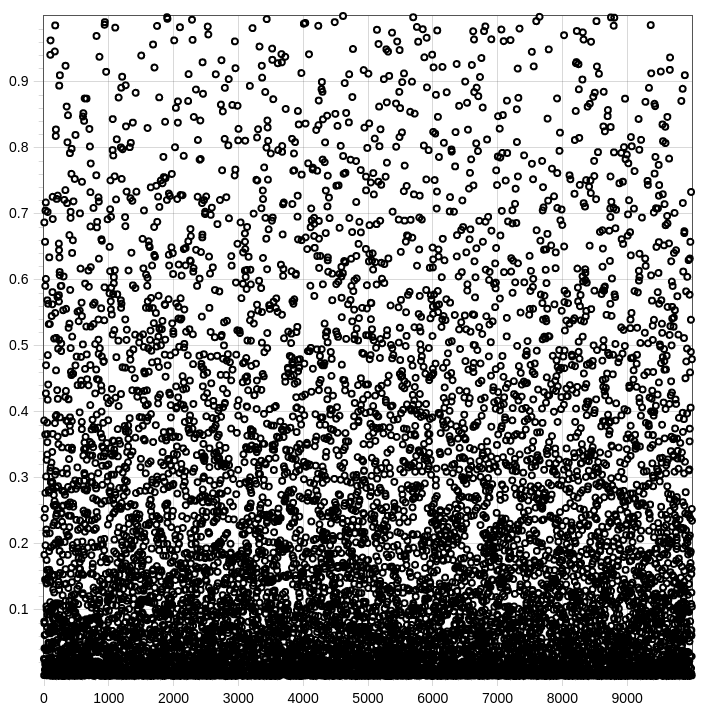

# Mapping X to ||X|| squared

##### It is done for 10 dimensions where X_{i} = [ X1, X2, ... , Xn ] 
##### X axis = i
##### Y axis = || X_{i} ||^2
  
### For 1000 samples
  
  
### For 10000 samples
  

### For 100000 samples
  
