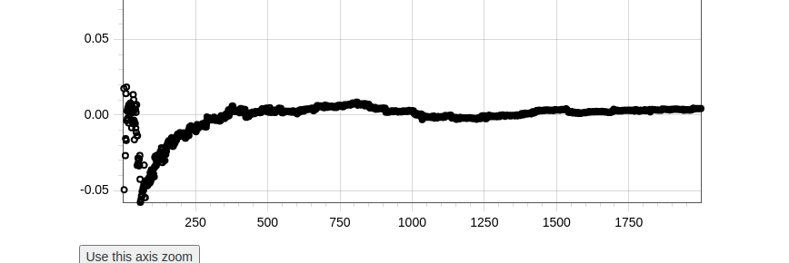

# 2D-plot-test
Just for quick showing purpose

### Average till i-th
##### X axis = i
##### Y axis = average till i samples
  

### For 100 samples
  
  
### For 1000 samples
  
  
### For 10000 samples
  

