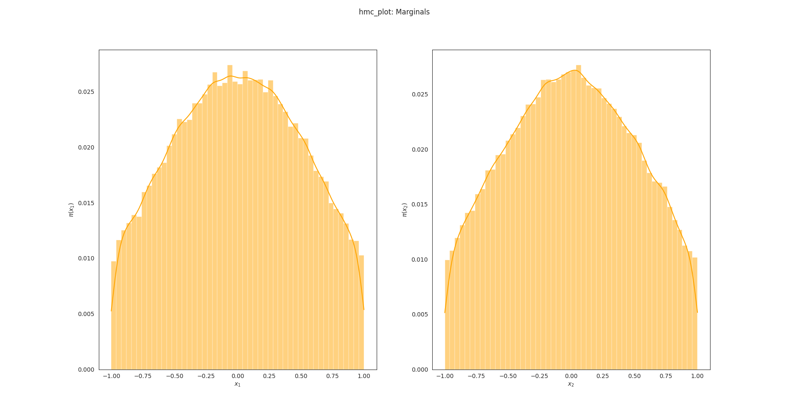

### HMC3 tests after warmup + Outer loops check

Following tests have been performed for 4 outer loops.

**Observation: Bell curve is becoming more pointy as `m` increases.**

#### ~150000 HMC points

